# Eyepiece Manual and Scripts

Once I figure out to use VLC or something else to stream data from the camera over Wi-Fi I'll post it here so you won't need some silly app just to view the telescope remotely. Work in progress!

---

## eyepiece_page_3.jpg

_Label / description placeholder_

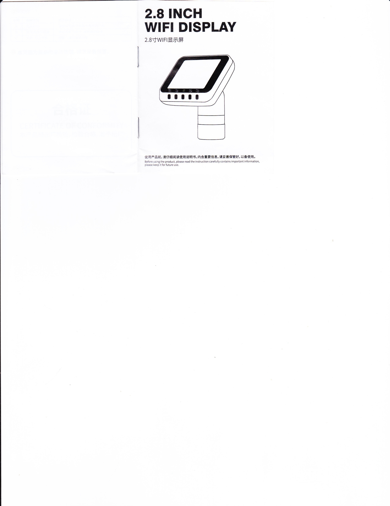

---

## eyepiece_page_4.jpg

_Label / description placeholder_

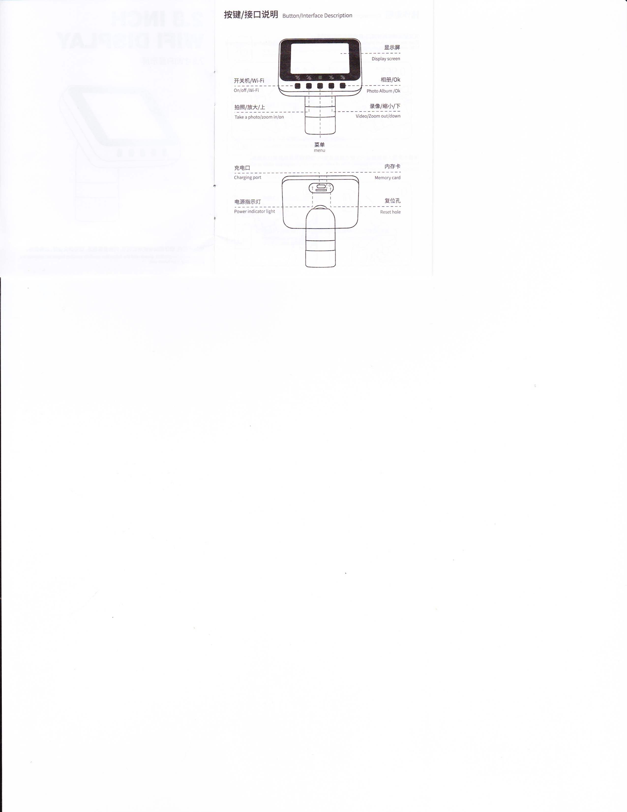

---

## eyepiece_page_5.jpg

_Label / description placeholder_

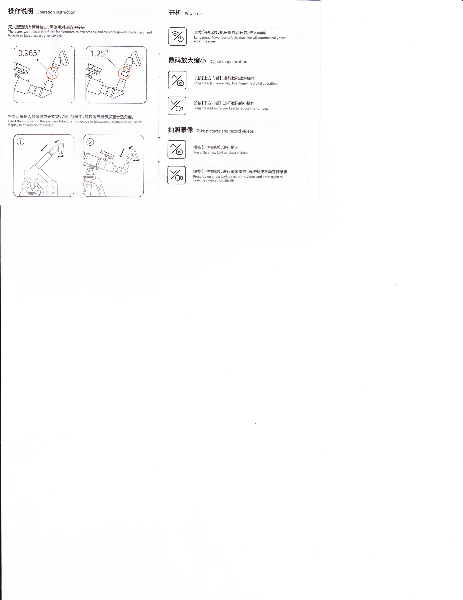

---

## eyepiece_page_6.jpg

_Label / description placeholder_

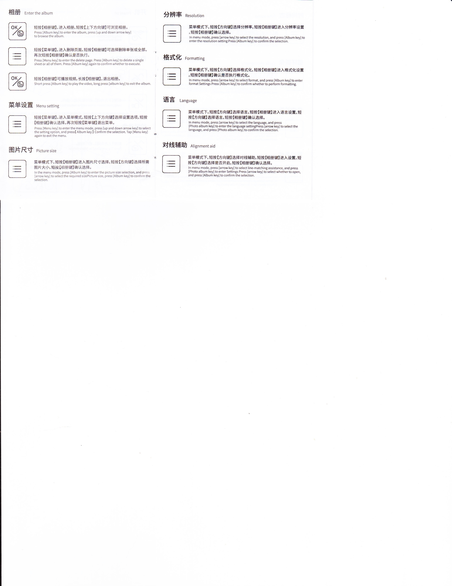

---

## eyepiece_page_7.jpg

_Label / description placeholder_

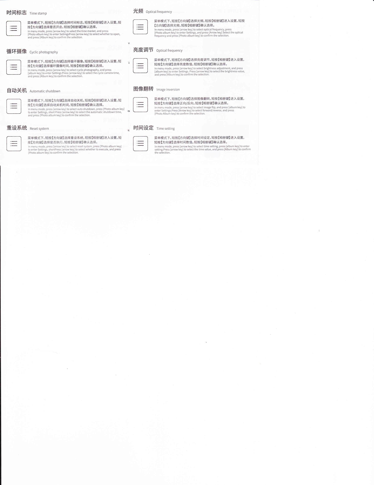

---

## eyepiece_page_8.jpg

_Label / description placeholder_

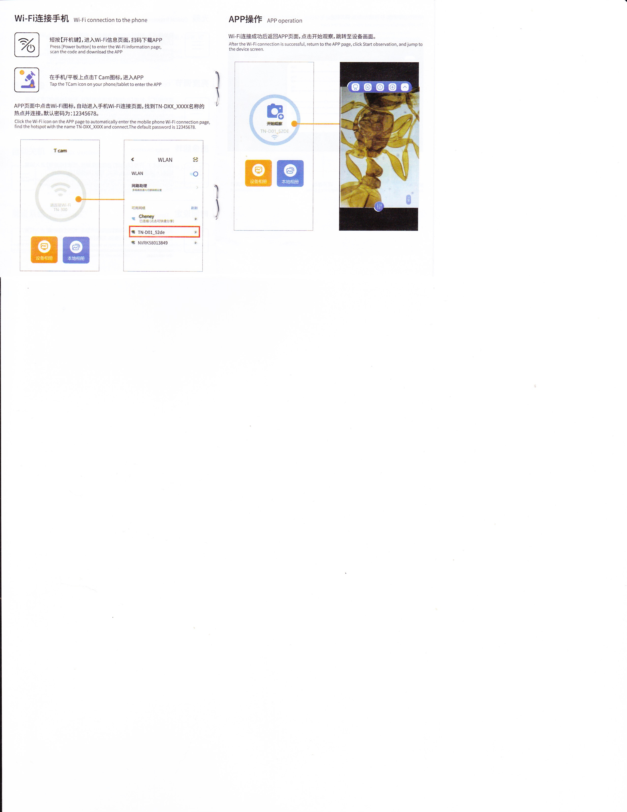

---

## eyepiece_page_9.jpg

_Label / description placeholder_

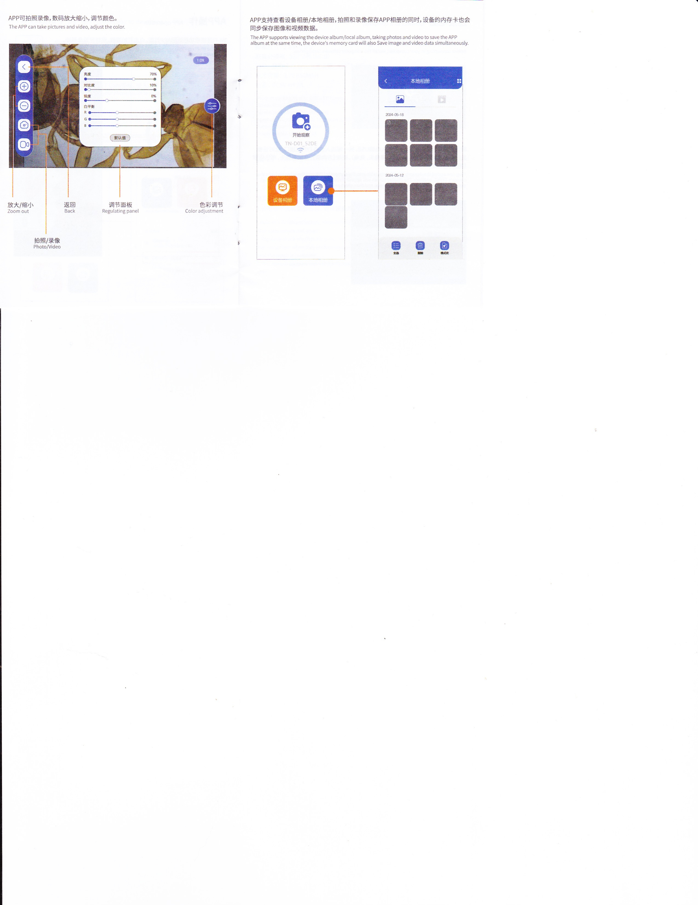

---

## eyepiece_page_10.jpg

_Label / description placeholder_

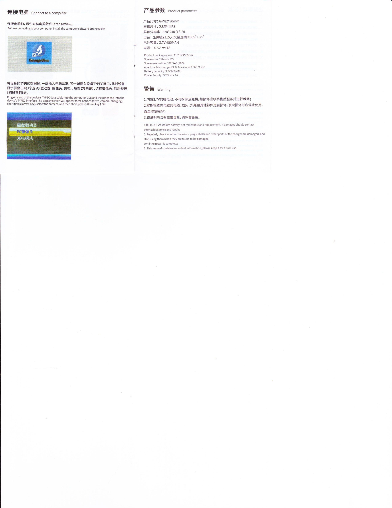

---

## eyepiece_page_11.jpg

_Label / description placeholder_

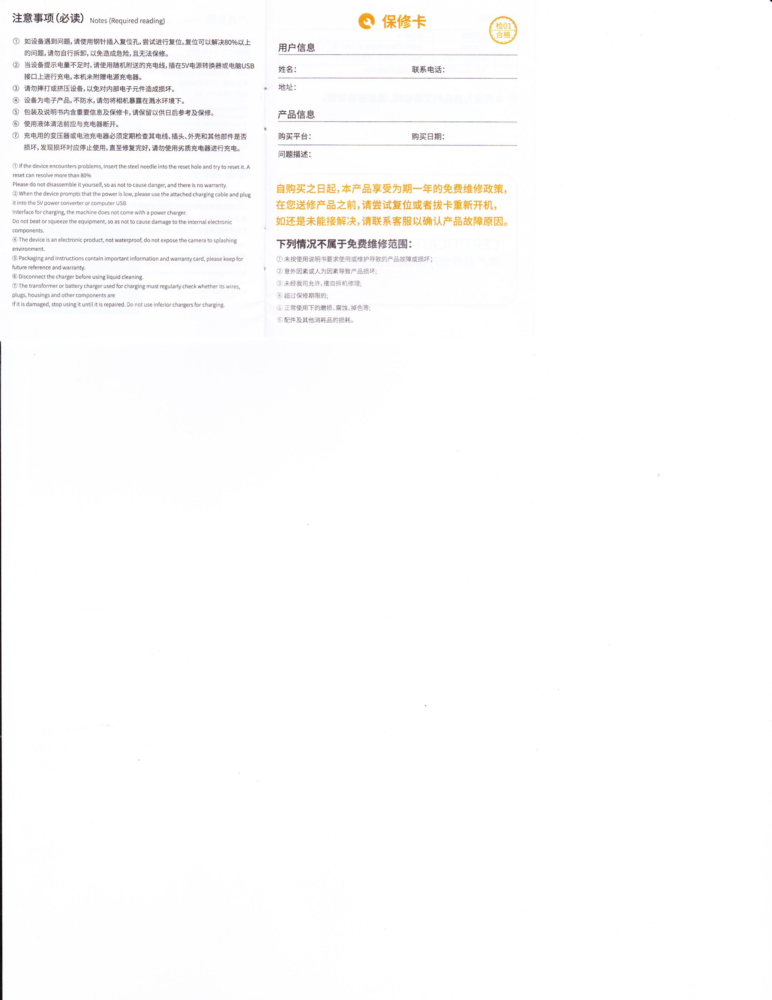

---

## eyepiece_page_12.jpg

_Label / description placeholder_

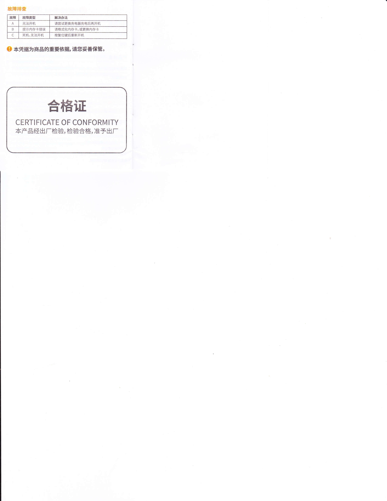

---

## eyepiece_page_13.jpg

_Label / description placeholder_

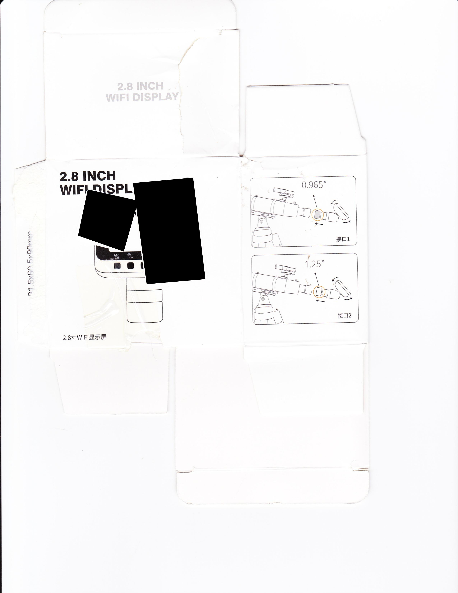

---

## eyepiece_page_14.jpg

_Label / description placeholder_

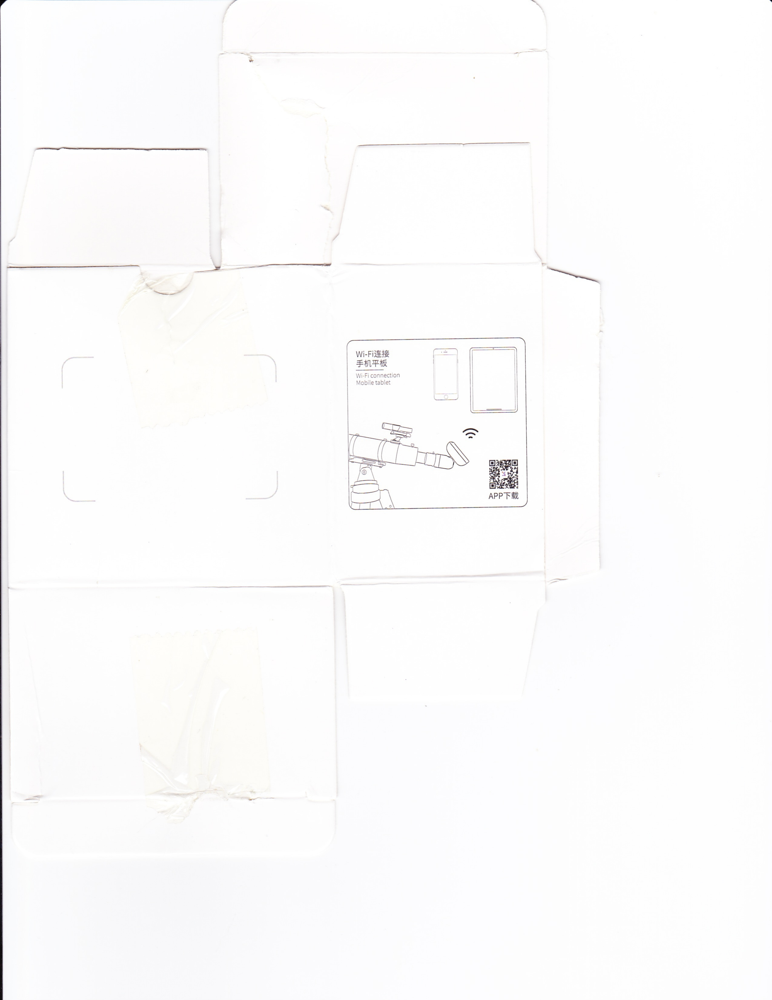

---

